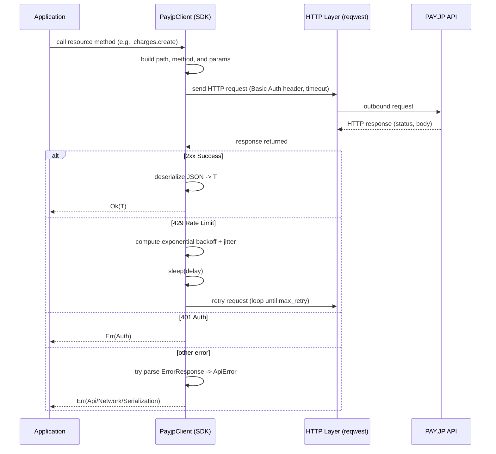

# PAY.JP Rust SDK

[](LICENSE)

[PAY.JP](https://pay.jp)（日本の決済プラットフォーム）向けのRust SDK。このライブラリは、すべてのPAY.JP APIに対して型安全なasync/awaitインターフェースを提供します。

[English](README.md) | 日本語

## 特徴

- 🦀 **型安全** - Rustの型システムによる完全な型安全性
- ⚡ **Async/await** - tokioベースの効率的な非同期処理
- 🔄 **自動リトライ** - ジッター付き指数バックオフによるレート制限対応
- 📦 **包括的** - すべてのPAY.JPリソースと操作をサポート
- 🏢 **プラットフォームAPI** - マルチテナントアプリケーションの完全サポート
- 🔒 **3Dセキュア** - 完全な3Dセキュア認証サポート

## インストール

`Cargo.toml`に以下を追加：

```toml
[dependencies]
payjp = "0.1.0"
tokio = { version = "1", features = ["full"] }
```

## クイックスタート

```rust
use payjp::{PayjpClient, CreateChargeParams};

#[tokio::main]
async fn main() -> Result<(), Box<dyn std::error::Error>> {
    // シークレットキーでクライアントを初期化
    let client = PayjpClient::new("sk_test_xxxxx")?;

    // 課金を作成
    let charge = client.charges().create(
        CreateChargeParams::new(1000, "jpy")
            .card("tok_xxxxx")  // クライアント側で作成されたトークン
            .description("商品購入")
    ).await?;

    println!("課金が作成されました: {}", charge.id);
    Ok(())
}
```

## ⚠️ 重要なセキュリティに関する注意

**本番環境では、生のカードデータを直接サーバーやAPIに送信しないでください。**

付属のサンプルコードは、テスト目的でのみ生のカードデータを使用してトークンを作成する方法を示しています。本番環境では：

1. **常にPAY.JP.js**（またはpayjp-ios/payjp-android）を使用してクライアント側でトークンを作成してください
2. 作成されたトークンのみをサーバーに送信してください
3. トークンを使用して課金、顧客、または定期課金を作成してください

### サンプルコードの実行

**✅ 推奨：トークンベースのサンプルを使用**

SDKをテストする最も簡単な方法は、事前に作成されたトークンを使用することです。

**方法1: SDKと公開可能キーでトークンを作成（SDK利用者に推奨）**

SDKの公開可能キークライアントを使って安全にトークンを作成：

```bash
# 公開可能キーとパスワード（pk_test_xxxxx:password）を使用
export PAYJP_PUBLIC_KEY="pk_test_xxxxx"
export PAYJP_PUBLIC_PASSWORD="your_password"
cargo run --example create_token_public

# サンプルがトークンIDを出力します。それを使用：
export PAYJP_SECRET_KEY="sk_test_xxxxx"
export PAYJP_TOKEN_ID="tok_xxxxx"  # 前のコマンドで取得したトークン
cargo run --example charge_with_token
```

この方法は、適切なアーキテクチャを示しています：
- クライアントは公開可能キー（とパスワード）を使ってトークンを作成
- サーバーはシークレットキーを使ってトークンで決済を処理
- カードデータは決してサーバーに送信されない

**方法2: HTMLページでトークンを作成（最も互換性が高い）**

PAY.JPアカウントで厳格なセキュリティ設定が有効な場合（`unsafe_credit_card_param`エラーが返される場合）、付属のHTMLページを使用してください：

```bash
# 1. create_token.html をウェブブラウザで開く
# 2. 公開可能キー（pk_test_xxxxx）を入力
# 3. 「トークンを作成」をクリックしてトークンを作成
# 4. 表示されたトークンIDをコピーして実行：

export PAYJP_SECRET_KEY="sk_test_xxxxx"
export PAYJP_TOKEN_ID="tok_xxxxx"  # HTMLページで作成したトークンを使用
cargo run --example charge_with_token
```

**方法2: スクリプトでトークンを作成**

```bash
# 1. APIキーを設定
export PAYJP_SECRET_KEY="sk_test_xxxxx"

# 2. トークン作成スクリプトを実行
./create_test_token.sh

# 3. スクリプトの出力からトークンIDをコピーして実行：
export PAYJP_TOKEN_ID="tok_xxxxx"  # スクリプト出力のトークンを使用
cargo run --example charge_with_token
```

**方法3: curlでトークンを作成**

```bash
curl -X POST https://api.pay.jp/v1/tokens \
  -u "sk_test_xxxxx:" \
  -d "card[number]=4242424242424242" \
  -d "card[exp_month]=12" \
  -d "card[exp_year]=2030" \
  -d "card[cvc]=123"

# レスポンスからトークンIDをコピーして使用：
export PAYJP_TOKEN_ID="tok_xxxxx"
cargo run --example charge_with_token
```

**注意**: 方法2と方法3は、アカウントで厳格なセキュリティ設定が有効な場合、`unsafe_credit_card_param`エラーで失敗する可能性があります。その場合は、方法1（HTMLページ）を使用してください。

**代替案：安全でないカードパラメータを許可する（利用可能な場合）**

一部のサンプルは生のカードデータでトークンを作成します。これらは`unsafe_credit_card_param`エラーで失敗する可能性があります。PAY.JPダッシュボードにこのオプションがある場合：

1. https://pay.jp/d/settings にアクセス
2. 「テストモード設定」で「安全でないカードパラメータを許可する」を有効にしてください
3. 次のようにサンプルを実行： `cargo run --example create_charge`

**注意**: すべてのPAY.JPアカウントにこの設定があるわけではありません。見つからない場合は、上記のHTMLページ方式を使用してください。

本番コードについては、クライアント側でのトークン作成方法について[PAY.JP.jsドキュメント](https://pay.jp/docs/payjs)を参照してください。

## サポートされているリソース

### コアリソース

- **Charges（課金）** - 決済の作成と管理
- **Customers（顧客）** - 顧客アカウントの管理
- **Cards（カード）** - 顧客の支払い方法の管理
- **Tokens（トークン）** - カード情報の安全なトークン化
- **Plans（プラン）** - 定期課金プランの定義
- **Subscriptions（定期課金）** - 定期支払いの管理

### 追加リソース

- **Transfers（入金）** - 入金情報の表示
- **Events（イベント）** - Webhookイベントの取得
- **Statements（取引明細）** - 取引明細へのアクセス
- **Balances（残高）** - アカウント残高の表示
- **Terms（集計期間）** - 集計期間の表示
- **Account（アカウント）** - アカウント情報の取得
- **3D Secure（3Dセキュア）** - 3Dセキュア認証の処理

### プラットフォームAPI

- **Tenants（テナント）** - サブマーチャントの管理
- **Tenant Transfers（テナント入金）** - テナント入金の表示

## 使用例

### 顧客の作成

```rust
use payjp::{PayjpClient, CreateCustomerParams};

let customer = client.customers().create(
    CreateCustomerParams::new()
        .email("customer@example.com")
        .card("tok_xxxxx")
        .metadata("customer_type", "premium")
).await?;
```

### 定期課金の作成

```rust
use payjp::{CreatePlanParams, CreateSubscriptionParams, PlanInterval};

// プランを作成
let plan = client.plans().create(
    CreatePlanParams::new(1000, "jpy", PlanInterval::Month)
        .name("月額プラン")
        .trial_days(7)
).await?;

// 顧客をプランに登録
let subscription = client.subscriptions().create(
    CreateSubscriptionParams::new(&customer.id, &plan.id)
).await?;
```

### カードの管理

```rust
use payjp::{CreateCardParams, UpdateCardParams};

// 顧客にカードを追加
let card = client.customer(&customer_id)
    .cards()
    .create(CreateCardParams::new("tok_xxxxx"))
    .await?;

// カード情報を更新
let updated = client.customer(&customer_id)
    .cards()
    .update(&card.id, UpdateCardParams::new().name("新しい名前"))
    .await?;

// すべてのカードを一覧表示
let cards = client.customer(&customer_id)
    .cards()
    .list(Default::default())
    .await?;
```

### 課金の返金

```rust
use payjp::RefundParams;

let refunded_charge = client.charges().refund(
    &charge.id,
    RefundParams::new()
        .amount(500)  // 部分返金
        .reason("顧客都合")
).await?;
```

### メタデータの利用

```rust
use payjp::CreateChargeParams;

let charge = client.charges().create(
    CreateChargeParams::new(1000, "jpy")
        .card("tok_xxxxx")
        .metadata("order_id", "12345")
        .metadata("customer_name", "山田太郎")
        .metadata("product", "商品A")
).await?;
```

### ページネーション付きリソースの一覧取得

```rust
use payjp::ListParams;

let charges = client.charges().list(
    ListParams::new()
        .limit(20)
        .offset(0)
).await?;

for charge in charges.data {
    println!("課金: {} - ¥{}", charge.id, charge.amount);
}
```

### 3Dセキュア認証

```rust
use payjp::CreateThreeDSecureRequestParams;

// トークンに対する3DSリクエストを作成
let tds_request = client.three_d_secure_requests().create(
    CreateThreeDSecureRequestParams::new("token", &token.id)
        .return_url("https://example.com/callback")
).await?;

// ユーザーが認証を完了...

// 3DS認証を完了
let completed_token = client.tokens().tds_finish(&token.id).await?;
```

### プラットフォームAPI - テナントの管理

```rust
use payjp::CreateTenantParams;

let tenant = client.tenants().create(
    CreateTenantParams::new()
        .name("サブマーチャント")
        .platform_fee_rate("0.10")  // 10%のプラットフォーム手数料
).await?;

// テナント向けの課金を作成
let charge = client.charges().create(
    CreateChargeParams::new(1000, "jpy")
        .card("tok_xxxxx")
        .tenant(&tenant.id)
        .platform_fee(100)
).await?;
```

## 設定

### カスタムクライアントオプション

```rust
use payjp::{PayjpClient, ClientOptions};
use std::time::Duration;

let options = ClientOptions::new()
    .timeout(Duration::from_secs(60))
    .max_retry(5)
    .retry_initial_delay(Duration::from_millis(500))
    .retry_max_delay(Duration::from_secs(30));

let client = PayjpClient::with_options("sk_test_xxxxx", options)?;
```

### レート制限

SDKは、ジッター付き指数バックオフでレート制限を自動的に処理します。`429 Too Many Requests`レスポンスを受信すると、SDKは遅延を増加させながらリクエストをリトライします。

PAY.JPのレート制限：

| モード | ゾーン | レート (req/sec) |
|------|------|----------------|
| Live | pk | 10 |
| Live | payment | 14 |
| Live | sk | 30 |
| Test | pk | 2 |
| Test | payment | 2 |
| Test | sk | 2 |

## アーキテクチャ

### リクエストフロー

以下のシークエンス図は、SDKのリクエストフローを示しています。SDKは自動的にリトライ、エラーハンドリング、認証を処理します。



### リクエストフローの説明

1. **アプリケーション呼び出し**: アプリケーションがSDKのリソースメソッド（例：`charges().create()`）を呼び出します。

2. **リクエスト構築**: SDKは内部でAPIパス、HTTPメソッド、パラメータを構築し、Basic認証ヘッダーとUser-Agentを付加します。

3. **HTTP送信**: reqwestライブラリを使用してHTTPリクエストをPAY.JP APIに送信します。タイムアウト設定も適用されます。

4. **レスポンス処理**:
   - **2xx 成功**: レスポンスボディをJSON→型`T`にデシリアライズし、`Ok(T)`を返します
   - **429 レート制限**: 指数バックオフ + ジッター（ランダム遅延）を計算し、遅延後に自動リトライします（`max_retry`回まで）
   - **401 認証エラー**: APIキーが無効な場合、`Err(PayjpError::Auth)`を返します
   - **その他のエラー**: APIエラーレスポンスをパースして`ApiError`に変換するか、ネットワークエラーやシリアライゼーションエラーとして返します

このアーキテクチャにより、アプリケーションコードはシンプルに保たれ、SDKが複雑なエラーハンドリングとリトライロジックを自動的に処理します。

## エラーハンドリング

```rust
use payjp::PayjpError;

match client.charges().retrieve("ch_invalid").await {
    Ok(charge) => println!("課金: {:?}", charge),
    Err(PayjpError::Api(api_err)) => {
        eprintln!("APIエラー: {}", api_err.message);
        eprintln!("エラーコード: {:?}", api_err.code);
    }
    Err(PayjpError::Network(net_err)) => {
        eprintln!("ネットワークエラー: {}", net_err);
    }
    Err(e) => eprintln!("その他のエラー: {}", e),
}
```

## セキュリティに関する考慮事項

### 生のカードデータを絶対に送信しない

**⚠️ 重要**: 生のカードデータをサーバーに送信しないでください。常にPAY.JP.jsを使用してクライアント側でトークンを作成してください。

`CardDetails`型はテストカードでのテスト目的でのみ提供されています。本番環境では：

1. フロントエンドでPAY.JP.jsを使用してカードデータをトークン化
2. トークンIDのみをサーバーに送信
3. トークンIDを使用して課金または顧客を作成

```javascript
// フロントエンド（JavaScript）
const payjp = Payjp('pk_test_xxxxx');
const token = await payjp.createToken(cardElement);
// token.idをサーバーに送信
```

```rust
// バックエンド（Rust）
let charge = client.charges().create(
    CreateChargeParams::new(1000, "jpy")
        .card(&token_id)  // フロントエンドからのトークンを使用
).await?;
```

### 金額制限

- 最小: ¥50
- 最大: ¥9,999,999

### 返金期間

返金は元の課金から180日以内に処理する必要があります。

### 与信保持期間

与信保持は1〜60日後に期限切れになります（デフォルト: 7日）。

## サンプルの実行

PAY.JPシークレットキーを環境変数として設定：

```bash
export PAYJP_SECRET_KEY=sk_test_xxxxx
```

サンプルを実行：

```bash
cargo run --example create_charge
cargo run --example create_customer
cargo run --example subscription
cargo run --example three_d_secure
```

## テスト

```bash
# ユニットテストを実行
cargo test

# すべての機能でテストを実行
cargo test --all-features
```

## ドキュメント

- [PAY.JP 公式APIドキュメント](https://pay.jp/docs/api/)
- [APIリファレンス (docs.rs)](https://docs.rs/payjp) (Coming soon)

## リソース

- [PAY.JP ウェブサイト](https://pay.jp)
- [PAY.JP ダッシュボード](https://pay.jp/dashboard)
- [テストカード](https://pay.jp/docs/testcard)

## ライセンス

このプロジェクトはMITライセンスの下でライセンスされています - 詳細は[LICENSE](LICENSE)ファイルを参照してください。

## 貢献

貢献を歓迎します！プルリクエストを自由に提出してください。

## 謝辞

- HTTPクライアントに[reqwest](https://github.com/seanmonstar/reqwest)を使用
- JSONシリアライゼーションに[serde](https://github.com/serde-rs/serde)を使用
- 他言語向けの公式PAY.JP SDKから着想を得ています

## 免責事項

これは非公式のSDKであり、PAY.JPによって承認または推奨されていません。
