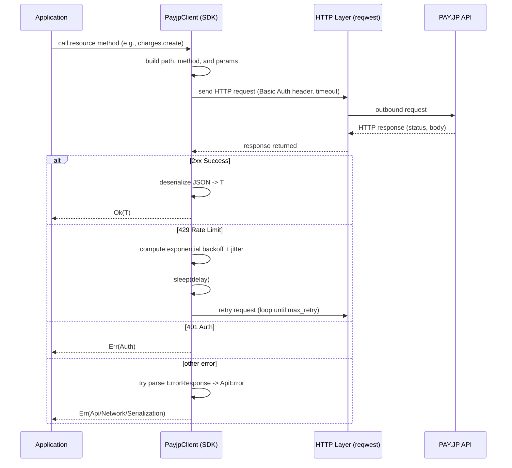

# PAY.JP Rust SDK

[](LICENSE)

Rust SDK for [PAY.JP](https://pay.jp), a Japanese payment platform. This library provides type-safe, async/await interfaces to all PAY.JP APIs.

English | [日本語](README.ja.md)

## Features

- 🦀 **Type-safe** - Full type safety with Rust's type system
- ⚡ **Async/await** - Built on tokio for efficient async operations
- 🔄 **Automatic retries** - Exponential backoff with jitter for rate limiting
- 📦 **Comprehensive** - Supports all PAY.JP resources and operations
- 🏢 **Platform API** - Full support for multi-tenant applications
- 🔒 **3D Secure** - Complete 3D Secure authentication support

## Installation

Add this to your `Cargo.toml`:

```toml
[dependencies]
payjp = "0.1.0"
tokio = { version = "1", features = ["full"] }
```

## Quick Start

```rust
use payjp::{PayjpClient, CreateChargeParams};

#[tokio::main]
async fn main() -> Result<(), Box<dyn std::error::Error>> {
    // Initialize the client with your secret key
    let client = PayjpClient::new("sk_test_xxxxx")?;

    // Create a charge
    let charge = client.charges().create(
        CreateChargeParams::new(1000, "jpy")
            .card("tok_xxxxx")  // Token created client-side
            .description("商品購入")
    ).await?;

    println!("Charge created: {}", charge.id);
    Ok(())
}
```

## ⚠️ Important Security Note

**Never send raw card data directly to your server or API in production.**

The included examples demonstrate creating tokens with raw card data for testing purposes only. In production environments:

1. **Always use PAY.JP.js** (or payjp-ios/payjp-android) to create tokens on the client side
2. Only send the resulting token to your server
3. Use the token to create charges, customers, or subscriptions

### Running Examples

**✅ Recommended: Use the token-based example**

The easiest way to test the SDK is to use a pre-created token.

**Method 1: Create token with SDK and public key (recommended for SDK users)**

Use the SDK's public key client to create tokens safely:

```bash
# Use your public key and password (pk_test_xxxxx:password)
export PAYJP_PUBLIC_KEY="pk_test_xxxxx"
export PAYJP_PUBLIC_PASSWORD="your_password"
cargo run --example create_token_public

# The example will output a token ID. Use it with:
export PAYJP_SECRET_KEY="sk_test_xxxxx"
export PAYJP_TOKEN_ID="tok_xxxxx"  # Token from the previous command
cargo run --example charge_with_token
```

This method demonstrates the proper architecture where:
- Clients use public keys (with password) to create tokens
- Servers use secret keys to process payments with tokens
- Card data never touches your server

**Method 2: Create token with HTML page (most compatible)**

If your PAY.JP account has strict security settings (returns `unsafe_credit_card_param` error), use the included HTML page:

```bash
# 1. Open create_token.html in your web browser
# 2. Enter your public key (pk_test_xxxxx)
# 3. Click "トークンを作成" to create a token
# 4. Copy the displayed token ID and run:

export PAYJP_SECRET_KEY="sk_test_xxxxx"
export PAYJP_TOKEN_ID="tok_xxxxx"  # Use the token from the HTML page
cargo run --example charge_with_token
```

**Method 3: Create token with script**

```bash
# 1. Set your API key
export PAYJP_SECRET_KEY="sk_test_xxxxx"

# 2. Run the token creation script
./create_test_token.sh

# 3. The script will output a token ID. Copy it and run:
export PAYJP_TOKEN_ID="tok_xxxxx"  # Use the token from script output
cargo run --example charge_with_token
```

**Method 4: Create token with curl**

```bash
curl -X POST https://api.pay.jp/v1/tokens \
  -u "sk_test_xxxxx:" \
  -d "card[number]=4242424242424242" \
  -d "card[exp_month]=12" \
  -d "card[exp_year]=2030" \
  -d "card[cvc]=123"

# Copy the token ID from the response and use it:
export PAYJP_TOKEN_ID="tok_xxxxx"
cargo run --example charge_with_token
```

**Note**: Methods 3 and 4 may fail with `unsafe_credit_card_param` error if your account has strict security settings. In that case, use Method 1 (SDK with public key) or Method 2 (HTML page).

**Alternative: Enable unsafe card parameters (if available)**

Some examples create tokens with raw card data. These may fail with an `unsafe_credit_card_param` error. If your PAY.JP dashboard has this option:

1. Go to: https://pay.jp/d/settings
2. Under "Test mode settings", enable "Allow unsafe card parameters"
3. Run examples like: `cargo run --example create_charge`

**Note**: Not all PAY.JP accounts have this setting available. If you cannot find it, use the HTML page method above.

For production code, always refer to the [PAY.JP.js documentation](https://pay.jp/docs/payjs) for client-side token creation.

## Supported Resources

### Core Resources

- **Charges** - Create and manage payments
- **Customers** - Manage customer accounts
- **Cards** - Manage customer payment methods
- **Tokens** - Tokenize card information securely
- **Plans** - Define recurring billing plans
- **Subscriptions** - Manage recurring payments

### Additional Resources

- **Transfers** - View payout information
- **Events** - Retrieve webhook events
- **Statements** - Access transaction statements
- **Balances** - View account balances
- **Terms** - View aggregation periods
- **Account** - Retrieve account information
- **3D Secure** - Handle 3D Secure authentication

### Platform API

- **Tenants** - Manage sub-merchants
- **Tenant Transfers** - View tenant payouts

## Usage Examples

### Creating a Customer

```rust
use payjp::{PayjpClient, CreateCustomerParams};

let customer = client.customers().create(
    CreateCustomerParams::new()
        .email("customer@example.com")
        .card("tok_xxxxx")
        .metadata("customer_type", "premium")
).await?;
```

### Creating a Subscription

```rust
use payjp::{CreatePlanParams, CreateSubscriptionParams, PlanInterval};

// Create a plan
let plan = client.plans().create(
    CreatePlanParams::new(1000, "jpy", PlanInterval::Month)
        .name("月額プラン")
        .trial_days(7)
).await?;

// Subscribe a customer to the plan
let subscription = client.subscriptions().create(
    CreateSubscriptionParams::new(&customer.id, &plan.id)
).await?;
```

### Managing Cards

```rust
use payjp::{CreateCardParams, UpdateCardParams};

// Add a card to a customer
let card = client.customer(&customer_id)
    .cards()
    .create(CreateCardParams::new("tok_xxxxx"))
    .await?;

// Update card details
let updated = client.customer(&customer_id)
    .cards()
    .update(&card.id, UpdateCardParams::new().name("新しい名前"))
    .await?;

// List all cards
let cards = client.customer(&customer_id)
    .cards()
    .list(Default::default())
    .await?;
```

### Refunding a Charge

```rust
use payjp::RefundParams;

let refunded_charge = client.charges().refund(
    &charge.id,
    RefundParams::new()
        .amount(500)  // Partial refund
        .reason("顧客都合")
).await?;
```

### Working with Metadata

```rust
use payjp::CreateChargeParams;

let charge = client.charges().create(
    CreateChargeParams::new(1000, "jpy")
        .card("tok_xxxxx")
        .metadata("order_id", "12345")
        .metadata("customer_name", "山田太郎")
        .metadata("product", "商品A")
).await?;
```

### Listing Resources with Pagination

```rust
use payjp::ListParams;

let charges = client.charges().list(
    ListParams::new()
        .limit(20)
        .offset(0)
).await?;

for charge in charges.data {
    println!("Charge: {} - ¥{}", charge.id, charge.amount);
}
```

### 3D Secure Authentication

```rust
use payjp::{CreateThreeDSecureRequestParams, CreateCustomerParams, CardOrId};

// First, create a customer with a token to get a card ID
let customer = client.customers().create(
    CreateCustomerParams::new()
        .email("customer@example.com")
        .card("tok_xxxxx")
).await?;

// Extract the card ID from the customer
let card_id = match &customer.default_card {
    Some(CardOrId::Id(id)) => id,
    Some(CardOrId::Card(card)) => &card.id,
    None => return Err("No card found".into()),
};

// Create a 3DS request for the card
let tds_request = client.three_d_secure_requests().create(
    CreateThreeDSecureRequestParams::new(card_id)
).await?;

// If authentication_url is present, redirect user to complete authentication
if let Some(auth_url) = &tds_request.authentication_url {
    println!("Redirect user to: {}", auth_url);
    // After user completes authentication, check the request status
}
```

### Platform API - Managing Tenants

```rust
use payjp::CreateTenantParams;

let tenant = client.tenants().create(
    CreateTenantParams::new()
        .name("サブマーチャント")
        .platform_fee_rate("0.10")  // 10% platform fee
).await?;

// Create a charge for a tenant
let charge = client.charges().create(
    CreateChargeParams::new(1000, "jpy")
        .card("tok_xxxxx")
        .tenant(&tenant.id)
        .platform_fee(100)
).await?;
```

## Configuration

### Custom Client Options

```rust
use payjp::{PayjpClient, ClientOptions};
use std::time::Duration;

let options = ClientOptions::new()
    .timeout(Duration::from_secs(60))
    .max_retry(5)
    .retry_initial_delay(Duration::from_millis(500))
    .retry_max_delay(Duration::from_secs(30));

let client = PayjpClient::with_options("sk_test_xxxxx", options)?;
```

### Rate Limiting

The SDK automatically handles rate limiting with exponential backoff and jitter. When a `429 Too Many Requests` response is received, the SDK will retry the request with increasing delays.

PAY.JP rate limits:

| Mode | Zone | Rate (req/sec) |
|------|------|----------------|
| Live | pk | 10 |
| Live | payment | 14 |
| Live | sk | 30 |
| Test | pk | 2 |
| Test | payment | 2 |
| Test | sk | 2 |

## Architecture

### Request Flow

The following sequence diagram illustrates the SDK's request flow. The SDK automatically handles retries, error handling, and authentication.



### Request Flow Explanation

1. **Application Call**: The application invokes an SDK resource method (e.g., `charges().create()`).

2. **Request Construction**: The SDK internally builds the API path, HTTP method, and parameters, adding Basic authentication header and User-Agent.

3. **HTTP Transmission**: Sends the HTTP request to the PAY.JP API using the reqwest library. Timeout settings are also applied.

4. **Response Processing**:
   - **2xx Success**: Deserializes the response body from JSON to type `T` and returns `Ok(T)`
   - **429 Rate Limit**: Calculates exponential backoff + jitter (random delay) and automatically retries after the delay (up to `max_retry` times)
   - **401 Authentication Error**: Returns `Err(PayjpError::Auth)` when the API key is invalid
   - **Other Errors**: Parses the API error response into `ApiError`, or returns as a network or serialization error

This architecture keeps application code simple while the SDK automatically handles complex error handling and retry logic.

## Error Handling

```rust
use payjp::PayjpError;

match client.charges().retrieve("ch_invalid").await {
    Ok(charge) => println!("Charge: {:?}", charge),
    Err(PayjpError::Api(api_err)) => {
        eprintln!("API Error: {}", api_err.message);
        eprintln!("Error code: {:?}", api_err.code);
    }
    Err(PayjpError::Network(net_err)) => {
        eprintln!("Network error: {}", net_err);
    }
    Err(e) => eprintln!("Other error: {}", e),
}
```

## Security Considerations

### Never Send Raw Card Data

**⚠️ IMPORTANT**: Never send raw card data to your server. Always use PAY.JP.js to create tokens client-side.

The `CardDetails` type is provided only for testing purposes with test cards. In production:

1. Use PAY.JP.js on your frontend to tokenize card data
2. Send only the token ID to your server
3. Use the token ID to create charges or customers

```javascript
// Frontend (JavaScript)
const payjp = Payjp('pk_test_xxxxx');
const token = await payjp.createToken(cardElement);
// Send token.id to your server
```

```rust
// Backend (Rust)
let charge = client.charges().create(
    CreateChargeParams::new(1000, "jpy")
        .card(&token_id)  // Use token from frontend
).await?;
```

### Amount Limits

- Minimum: ¥50
- Maximum: ¥9,999,999

### Refund Period

Refunds must be processed within 180 days of the original charge.

### Authorization Hold Period

Authorization holds expire after 1-60 days (default: 7 days).

## Running Examples

Set your PAY.JP secret key as an environment variable:

```bash
export PAYJP_SECRET_KEY=sk_test_xxxxx
```

Run an example:

```bash
cargo run --example create_charge
cargo run --example create_customer
cargo run --example subscription
cargo run --example three_d_secure
```

## Testing

```bash
# Run unit tests
cargo test

# Run with all features
cargo test --all-features
```

## Documentation

- [PAY.JP Official API Documentation](https://pay.jp/docs/api/)
- [API Reference (docs.rs)](https://docs.rs/payjp) (Coming soon)

## Resources

- [PAY.JP Website](https://pay.jp)
- [PAY.JP Dashboard](https://pay.jp/dashboard)
- [Test Cards](https://pay.jp/docs/testcard)

## License

This project is licensed under the MIT License - see the [LICENSE](LICENSE) file for details.

## Contributing

Contributions are welcome! Please feel free to submit a Pull Request.

## Acknowledgments

- Built with [reqwest](https://github.com/seanmonstar/reqwest) for HTTP client
- Uses [serde](https://github.com/serde-rs/serde) for JSON serialization
- Inspired by official PAY.JP SDKs for other languages

## Disclaimer

This is an unofficial SDK and is not affiliated with or endorsed by PAY.JP.
